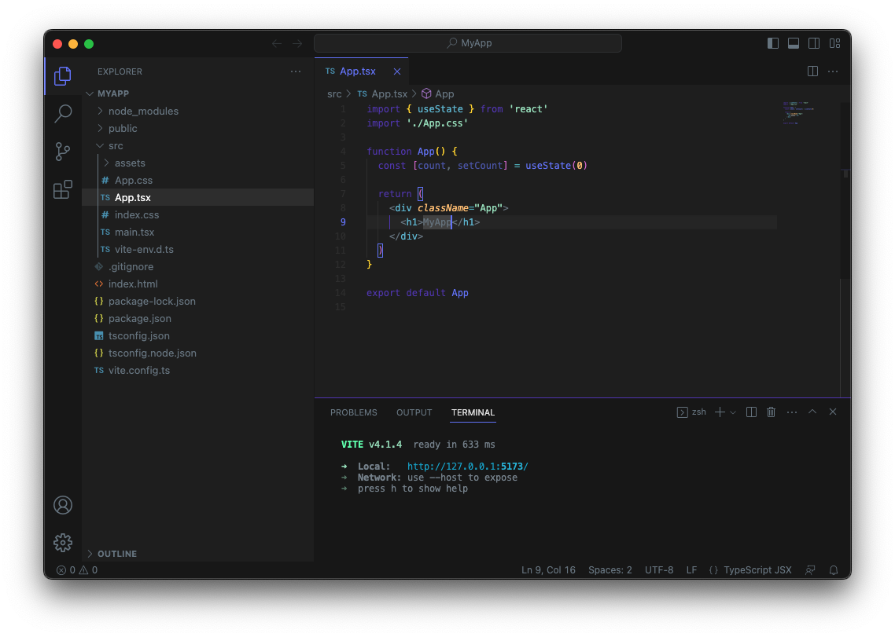
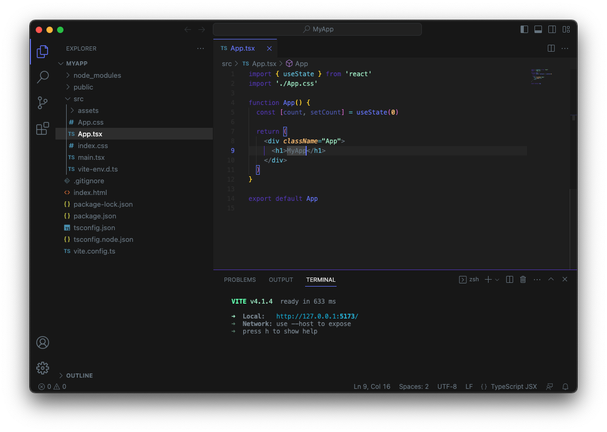

<h1 align="center">
   
    
   
   
  Aconitum
   
   
</h1>

<h4 align="center">/a.koˈniː.tum/ - danger, use careful.</h4>

  
  

<figure>
<figcaption align = "center"><i>Aconitum </i></figcaption>

</figure>

<figure>
<figcaption align = "center"><i>Aconitum Clean</i></figcaption>

</figure>

 
 

## What's new?

Click here to go to the [Changelog](CHANGELOG.md)

## License
[GNU General Public License v3.0](LICENSE)